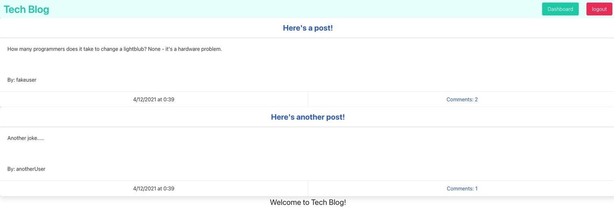

# TechBlog

## Description
TechBlog is a CMS style blog site. Developers can publish blog posts and comment on other users posts. There are user names, profiles, log ins, comments, and dashboards on this blog. It was built following the MVC paradigm.

This repo is deployed at: https://stark-mesa-75769.herokuapp.com/

Here is a image of the deployed blog site:

## Table of Contents
* [Installation](#installation)
* [Usage](#usage)
* [License](#license)
* [Contributing](#contributing)
* [Tests](#tests)
* [Questions](#questions)

## Installation
To install dependencies, run the following:
`
npm i
`
You'll need bcrypt, sequelize, dotenv, express & express handlebars, express session, mysql2, and passport npm packages to run this locally. 

## License
This repository is licensed under the MIT: (https://opensource.org/licenses/MIT) license.

